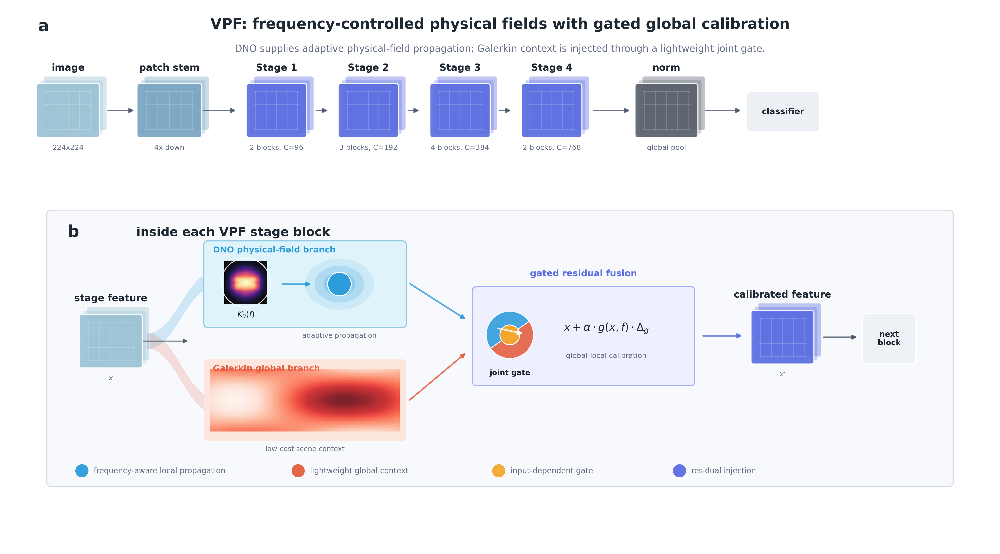

# VPF

VPF is a shared vision backbone for image classification, object detection,
semantic segmentation, and autonomous-driving perception.



## 1. Environment setup

All tasks use one unified Conda environment. Package versions are recorded in
`requirements.txt`.

```bash
git clone <YOUR_VPF_REPOSITORY_URL> vpf-open
cd vpf-open

conda create -n vpf_det python=3.9 -y
conda activate vpf_det

# Install shared dependencies
python -m pip install -r requirements.txt

# Install OpenMMLab packages separately
mim install mmcv==2.1.0
python -m pip install \
  mmengine==0.10.1 mmdet==3.3.0 \
  mmsegmentation==1.2.2 mmpretrain==1.2.0

# Register the local src/vpf package in this environment
python -m pip install -e . --no-deps --no-build-isolation
```

Verify the installation:

```bash
python -m unittest discover -s tests -v
python tools/check_configs.py
```

All commands below should be run from the repository root. Datasets are placed
under `data/` by default, while logs and checkpoints are written under
`outputs/`. Both directories are ignored by Git.

## 2. Standard vision tasks

### 2.1 ImageNet-1K classification

Expected dataset layout:

```text
data/imagenet/
├── train/<class_name>/*.JPEG
└── val/<class_name>/*.JPEG
```

Train on one GPU:

```bash
torchrun --standalone --nproc_per_node=1 \
  tasks/classification/main.py \
  --cfg tasks/classification/configs/vpf_tiny_224.yaml \
  --data-path data/imagenet \
  --batch-size 128 \
  --output outputs/classification
```

Evaluate:

```bash
torchrun --standalone --nproc_per_node=1 \
  tasks/classification/main.py \
  --cfg tasks/classification/configs/vpf_tiny_224.yaml \
  --data-path data/imagenet \
  --resume /path/to/classification_checkpoint.pth \
  --eval --batch-size 128 \
  --output outputs/classification_eval
```

For multi-GPU training or evaluation, set `--nproc_per_node` to the number of
visible GPUs. `--batch-size` is the per-GPU batch size.

### 2.2 COCO object detection

Expected dataset layout:

```text
data/coco/
├── train2017/
├── val2017/
└── annotations/
```

Train:

```bash
python tasks/detection/train.py \
  tasks/detection/configs/coco/vpf_tiny_1x.py \
  --work-dir outputs/detection/coco_vpf_tiny_1x \
  --cfg-options \
  model.backbone.pretrained=/path/to/classification_checkpoint.pth
```

Evaluate:

```bash
python tasks/detection/test.py \
  tasks/detection/configs/coco/vpf_tiny_1x.py \
  outputs/detection/coco_vpf_tiny_1x/epoch_12.pth \
  --work-dir outputs/detection/coco_vpf_tiny_1x/eval
```

### 2.3 ADE20K semantic segmentation

Expected dataset layout:

```text
data/ade20k/
├── images/
└── annotations/
```

Train:

```bash
python tasks/segmentation/train.py \
  tasks/segmentation/configs/ade20k/vpf_tiny_160k.py \
  --work-dir outputs/segmentation/ade20k_vpf_tiny_160k \
  --cfg-options \
  model.backbone.pretrained=/path/to/classification_checkpoint.pth
```

Evaluate:

```bash
python tasks/segmentation/test.py \
  tasks/segmentation/configs/ade20k/vpf_tiny_160k.py \
  outputs/segmentation/ade20k_vpf_tiny_160k/iter_160000.pth \
  --work-dir outputs/segmentation/ade20k_vpf_tiny_160k/eval
```

## 3. Autonomous-driving tasks

The autonomous-driving suite covers three datasets:

- BDD100K for object detection.
- ACDC for object detection and adverse-condition semantic segmentation.
- Cityscapes for semantic segmentation.

### 3.1 BDD100K object detection

Place the original BDD100K images and labels under `data/bdd100k`, then convert
the 10 detection classes to COCO format:

```bash
python tasks/autonomous_driving/datasets/bdd100k_det_to_coco.py \
  --bdd-root data/bdd100k \
  --out-dir data/bdd100k/bdd100k_det_10cls_coco/annotations
```

Train:

```bash
python tasks/autonomous_driving/train.py \
  tasks/autonomous_driving/configs/detection/bdd100k/vpf_tiny_3x.py \
  --work-dir outputs/autonomous_driving/bdd100k_vpf_tiny \
  --cfg-options \
  model.backbone.pretrained=/path/to/classification_checkpoint.pth
```

Evaluate:

```bash
python tasks/autonomous_driving/test.py \
  tasks/autonomous_driving/configs/detection/bdd100k/vpf_tiny_3x.py \
  outputs/autonomous_driving/bdd100k_vpf_tiny/epoch_36.pth \
  --work-dir outputs/autonomous_driving/bdd100k_vpf_tiny/eval
```

### 3.2 ACDC

#### ACDC object detection

The detection config expects six-class COCO annotations at:

```text
data/acdc/acdc_6cls_cocojson/annotations/train_6cls_coco.json
data/acdc/acdc_6cls_cocojson/annotations/val_6cls_coco.json
```

Image paths stored in the JSON files must be relative to `data/acdc/`.

Train:

```bash
python tasks/autonomous_driving/train.py \
  tasks/autonomous_driving/configs/detection/acdc/vpf_tiny.py \
  --work-dir outputs/autonomous_driving/acdc_detection_vpf \
  --cfg-options \
  model.backbone.pretrained=/path/to/classification_checkpoint.pth
```

Evaluate:

```bash
python tasks/autonomous_driving/test.py \
  tasks/autonomous_driving/configs/detection/acdc/vpf_tiny.py \
  outputs/autonomous_driving/acdc_detection_vpf/epoch_36.pth \
  --work-dir outputs/autonomous_driving/acdc_detection_vpf/eval
```

#### ACDC semantic segmentation

Convert the original ACDC dataset to the MMSegmentation/Cityscapes layout:

```bash
python tasks/autonomous_driving/datasets/prepare_acdc_mmseg.py \
  --src-root data/acdc \
  --out-root data/acdc/mmseg_format \
  --copy
```

Train:

```bash
python tasks/segmentation/train.py \
  tasks/autonomous_driving/configs/segmentation/acdc/vpf_tiny_40k.py \
  --work-dir outputs/autonomous_driving/acdc_segmentation_vpf \
  --cfg-options \
  model.backbone.pretrained=/path/to/classification_checkpoint.pth
```

Evaluate:

```bash
python tasks/segmentation/test.py \
  tasks/autonomous_driving/configs/segmentation/acdc/vpf_tiny_40k.py \
  outputs/autonomous_driving/acdc_segmentation_vpf/iter_40000.pth \
  --work-dir outputs/autonomous_driving/acdc_segmentation_vpf/eval
```

### 3.3 Cityscapes semantic segmentation

Use the standard Cityscapes directory layout:

```text
data/cityscapes/
├── leftImg8bit/
└── gtFine/
```

Train:

```bash
python tasks/segmentation/train.py \
  tasks/autonomous_driving/configs/segmentation/cityscapes/vpf_tiny_80k.py \
  --work-dir outputs/autonomous_driving/cityscapes_vpf \
  --cfg-options \
  model.backbone.pretrained=/path/to/classification_checkpoint.pth
```

Evaluate:

```bash
python tasks/segmentation/test.py \
  tasks/autonomous_driving/configs/segmentation/cityscapes/vpf_tiny_80k.py \
  outputs/autonomous_driving/cityscapes_vpf/iter_80000.pth \
  --work-dir outputs/autonomous_driving/cityscapes_vpf/eval
```

## 4. Repository layout

```text
src/vpf/                       shared backbone and framework adapters
tasks/classification/          ImageNet classification
tasks/detection/               COCO detection
tasks/segmentation/            ADE20K segmentation
tasks/autonomous_driving/      BDD100K, ACDC, and Cityscapes
tools/                         analysis and visualization utilities
tests/                         smoke tests and config checks
```

See `docs/datasets.md` for additional dataset details and
`docs/reproduction.md` for checkpoint usage. Before public release, add the
final citation, checkpoint URLs, author information, and repository license.
